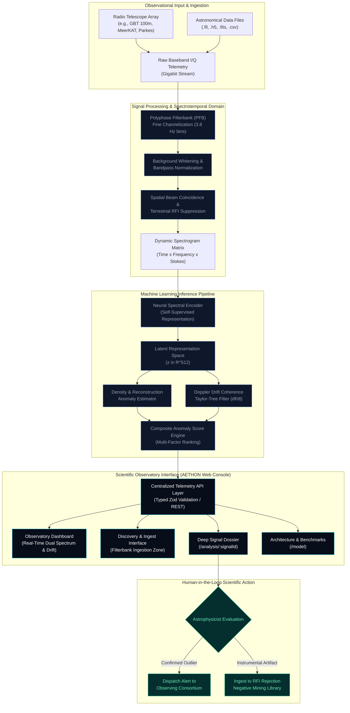
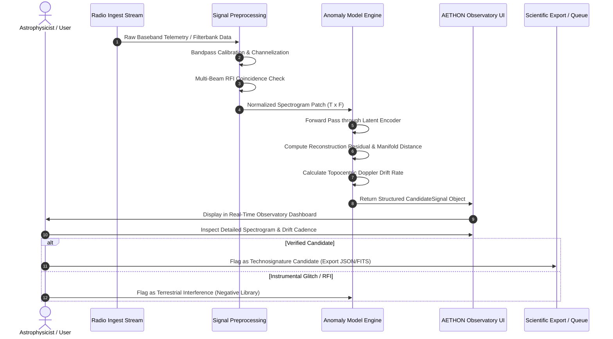

# AETHON

### AI-Assisted Discovery of Anomalous Astronomical Radio Signatures

[](https://www.typescriptlang.org/)
[](https://react.dev/)
[](https://vite.dev/)
[](https://www.python.org/)
[](https://scikit-learn.org/)
[](https://tailwindcss.com/)
[](LICENSE)
[](#)

> **AETHON** is an AI-driven scientific framework designed for automated detection and characterization of uncatalogued radio-frequency anomalies in high-cadence astronomical telemetry. Developed for the **AstroNITR World Space Week 2026 — Rocket Revolution** AI/ML challenge, the system addresses open-ended discovery where observational targets lack prior labeled training examples.

---

## 1. Concept & Scientific Mission

Modern radio observatories collect terabytes of wideband electromagnetic observations per second. Within these data streams lie known astrophysical phenomena (such as pulsars and neutral hydrogen emissions), alongside pervasive terrestrial Radio-Frequency Interference (RFI) and thermal instrument noise. Crucially, the data may also conceal faint, uncatalogued astronomical transients or narrowband technosignature candidates that exhibit no prior observational template.

AETHON operates not as a static catalog classifier, but as an **automated discovery instrument**. By modelling the baseline distributions of known astrophysical emissions, local instrumental noise, and anthropogenic RFI, AETHON constructs low-dimensional spectrotemporal latent representations to isolate statistically significant outliers. These candidate events are prioritized via interpretable anomaly scoring and elevated to astrophysicists for high-resolution verification.

```
                    ┌────────────────────────────────────────────────────────┐
                    │                   AETHON PHILOSOPHY                    │
                    │                                                        │
                    │   A conventional classifier asks:                      │
                    │   "Which known astronomical class does this fit?"      │
                    │                                                        │
                    │   A discovery system must also ask:                    │
                    │   "Is this something we have never observed before?"   │
                    └────────────────────────────────────────────────────────┘
```

---

## 2. The Problem Statement

**Challenge Context:** AstroNITR World Space Week 2026 — _Rocket Revolution: Discovering Unknown Radio Signals_

In observational radio astronomy, discovery pipelines face three fundamental hurdles:

1. **Massive Observational Volume:** Gigahertz-bandwidth receivers and multi-beam phased array feeds generate data volumes exceeding human inspection capabilities.
2. **The Open-Set Paradox:** Supervised machine learning algorithms require large collections of verified labels. When searching for unknown astrophysical transients or technosignatures, **no ground-truth labels exist prior to discovery**. Forcing unknown signals into predetermined classification categories leads to catastrophic misattribution or dismissal as noise.
3. **Severe Anthropogenic Contamination:** Low-Earth orbit (LEO) satellite mega-constellations, terrestrial 5G/radar infrastructure, and airborne transmitters flood telescope receivers with non-stationary RFI that mimics candidate signatures unless filtered by rigorous spatial and Doppler-drift constraints.

---

## 3. Core Architecture & Discovery Philosophy

AETHON is built around **Normality Modelling and Latent Manifold Projection**. Rather than attempting to learn every possible manifestation of an unknown signal, the system learns the spectrotemporal topology of normal baseline observation regimes:

- **Normality Learning:** Baseline cosmic microwave noise, diffuse galactic background, and receiver thermal fluctuations form a predictable statistical distribution in spectrotemporal space.
- **Latent Manifold Mapping:** High-dimensional dynamic spectra (waterfall arrays of Time × Frequency × Polarization) are compressed into compact latent representations.
- **Reconstruction Deviation & Outlier Metrics:** Signals that cannot be accurately reconstructed by baseline models—or that reside in low-density regions of the latent manifold—receive high anomaly scores.
- **Doppler-Drift Coherence Verification:** Natural extraterrestrial signals and distant sources exhibit a characteristic topocentric frequency drift rate ($\Delta f / \Delta t$) due to relative orbital motion, enabling automatic discrimination against ground-based transmitters.
- **Human-in-the-Loop Scientific Investigation:** Flagged anomalies are presented inside a high-precision observatory interface complete with spectral cross-sections, drift history, and exportable provenance metadata.

---

## 4. System Architecture

The following diagram illustrates the complete end-to-end data lifecycle, from radio telescope antenna baseband ingestion down to astrophysicist verification:



> **Implementation Note:** The frontend scientific observatory interface, client telemetry layer, Zod validation schemas, data contracts, and interactive visualization charts are fully implemented in the current codebase. The deep neural inference pipeline components represent the target backend architecture designed for production radio astronomy integration.

---

## 5. Machine Learning Methodology

### 5.1 Why Supervised Learning Fails in Open Discovery

Supervised deep neural networks excel at closed-world classification tasks (e.g., distinguishing a known pulsar from Gaussian white noise). However, under open-ended astronomical discovery:

- Unobserved natural phenomena (e.g., exotic neutron star magnetospheres, anomalous plasma masers) lack training exemplars.
- Technosignature candidates may take unpredictable forms across the spectrotemporal plane.
- Classifiers trained with fixed softmax outputs will assign an arbitrary, erroneous classification to anomalous inputs with artificially inflated confidence.

### 5.2 Unsupervised & Self-Supervised Representation Learning

AETHON adopts self-supervised and unsupervised representation learning:

1. **Masked Spectrogram Autoencoding:**
   Dynamic spectra $X \in \mathbb{R}^{T \times F}$ are partially masked across random time-frequency patches. An encoder learns to project unmasked regions into a latent vector $z = \mathcal{E}(X)$, while a decoder attempts reconstruction $\hat{X} = \mathcal{D}(z)$. Because the model learns standard background noise distributions, highly coherent non-random signals produce elevated reconstruction residuals:
   $$\mathcal{L}_{\text{rec}}(X) = \| X - \hat{X} \|_2^2$$

2. **Latent Manifold Density Estimation:**
   In addition to reconstruction error, the position of embedding $z$ within the learned manifold is evaluated against background clusters:
   $$D_{\text{latent}}(z) = \min_{k} (z - \mu_k)^T \Sigma_k^{-1} (z - \mu_k)$$
   Observations falling into extreme low-density regions indicate unprecedented morphology.

3. **Contrastive RFI Discrimination:**
   Using multi-feed receiver pointing data (e.g., ON-target vs. OFF-target pointings), signals appearing simultaneously in off-axis sidelobes are assigned negative contrastive pairs to suppress common-mode terrestrial contamination.

### 5.3 Methodological Implementation Status

| Technique / Model Component              | Status                 | Architectural Role                                                                            |
| :--------------------------------------- | :--------------------- | :-------------------------------------------------------------------------------------------- |
| **Zod Schema Contracts & Validation**    | **Implemented**        | Type-safe candidate signal data model, observation records, and inference predictions         |
| **Interactive FFT & Drift Visualizer**   | **Implemented**        | High-precision Recharts spectral power distribution & topocentric drift visualization         |
| **Filterbank Upload & Intake Flow**      | **Implemented**        | Client-side intake buffer supporting `.fil`, `.h5`, `.fits`, `.csv` with simulated inference  |
| **Candidate Prioritization & Filtering** | **Implemented**        | Dynamic sorting by anomaly score, SNR, frequency band, and verification state                 |
| **Self-Supervised Transformer Backbone** | _Architected (Target)_ | 12-layer spectral vision transformer for spectrotemporal patch encoding                       |
| **Taylor-Tree Doppler De-drifting**      | _Architected (Target)_ | Accelerated de-dispersion and Doppler search over acceleration space $[-20, +20]\text{ Hz/s}$ |
| **Contrastive Sidelobe RFI Filter**      | _Architected (Target)_ | Multi-beam spatial coincidence comparator                                                     |

---

## 6. Signal Processing & Spectrotemporal Domain

Radio telescope receivers record high-frequency voltages corresponding to the electric field vector incident on the antenna feed. AETHON leverages the **spectrotemporal representation** (dynamic spectra):

- **Polyphase Filterbank (PFB):** Raw digitized time series are passed through overlapping polyphase filter branches to minimize inter-channel spectral leakage, creating resolution bins as fine as $3.8\text{ Hz}$.
- **Hydrogen Line Reference (1420.4057 MHz):** The spin-flip transition of neutral hydrogen ($21\text{ cm}$) serves as the primary observational baseline in the interstellar "Water Hole". AETHON includes automated calibration lines around 1.420 GHz.
- **Topocentric Doppler Shift:** Because the radio antenna is attached to Earth (a rotating body orbiting the Sun), celestial emissions exhibit an apparent linear drift:
  $$\dot{f} = -\frac{f_0}{c} \left( \vec{a}_{\text{orbit}} + \vec{a}_{\text{rot}} \right) \cdot \hat{n}$$
  Signals exhibiting zero drift over extended integration times are immediately flagged as local terrestrial transmitters.

---

## 7. Candidate Discovery Pipeline Lifecycle

The lifecycle of an astronomical observation from initial antenna ingestion to scientific logging is illustrated below:



---

## 8. Proposed Candidate Scoring Architecture

To avoid treating anomaly detection as an opaque black box, AETHON proposes a composite, multi-criteria **Candidate Anomaly Index** ($\mathcal{S}_{\text{candidate}} \in [0, 1]$):

$$\mathcal{S}_{\text{candidate}} = w_1 \cdot \mathcal{A}_{\text{morph}} + w_2 \cdot \mathcal{C}_{\text{drift}} + w_3 \cdot \mathcal{P}_{\text{time}} - w_4 \cdot \mathcal{R}_{\text{RFI}}$$

Where:

- $\mathcal{A}_{\text{morph}}$ (**Morphological Outlier Metric**): Latent-space distance from nearest known baseline emission cluster.
- $\mathcal{C}_{\text{drift}}$ (**Doppler Coherence**): Measure of linearity and adherence to non-zero physical topocentric drift rates ($\dot{f} \neq 0$).
- $\mathcal{P}_{\text{time}}$ (**Persistence / SNR Margin**): Temporal stability of the signal exceeding local thermal noise floor ($>10\text{ dB}$).
- $\mathcal{R}_{\text{RFI}}$ (**Interference Probability**): Penalty score derived from presence in concurrent off-target telescope beams or known satellite frequency allocations.
- $w_1, w_2, w_3, w_4$ (**Calibration Weights**): Normalized scientific hyperparameters configured according to observational band.

---

## 9. Observatory Interface (UI Architecture)

The AETHON frontend is designed with the aesthetic and functional rigor of **aerospace telemetry instrumentation and deep-space mission control**:

| Route                 | Page Module             | Scientific Purpose                                                                                                                                                |
| :-------------------- | :---------------------- | :---------------------------------------------------------------------------------------------------------------------------------------------------------------- |
| `/`                   | **Landing / Mission**   | Mission briefing, active aperture frequency status, primary architectural pillars                                                                                 |
| `/observatory`        | **Observatory Console** | Live dual telemetry: FFT Spectral Power Distribution (1420.405 MHz HI reference) and Doppler Drift Cadence ($\Delta f / \Delta t$) with real-time stream controls |
| `/discover`           | **Discovery Feed**      | Ingestion portal for `.fil`, `.h5`, `.fits`, `.csv` data files; priority-ranked candidate discovery queue                                                         |
| `/analysis/:signalId` | **Signal Dossier**      | Full deep-dive analytical view: celestial coordinates (RA/DEC), model classification probabilities, signal export (JSON), and verification controls               |
| `/model`              | **ML Architecture**     | Technical breakdown of the 4-stage neural pipeline, attention encoders, and synthetic benchmark matrix                                                            |
| `/about`              | **Scientific Context**  | Theoretical foundations: the Hydrogen line, Doppler drift kinematics, and terrestrial RFI mitigation                                                              |

### Visual Design Tokens

- **Color Palette:** Deep-space obsidian (`#030712`), console surface slate (`#080d1a`, `#0d1527`), hairline structural borders (`#172338`).
- **Accents:** Hydrogen-line cyan (`#06b6d4`), sky blue (`#38bdf8`), telemetry emerald (`#10b981`), anomaly rose (`#f43f5e`).
- **Typography:** Dual pairing with `JetBrains Mono` for frequency numbers and telemetry metrics, paired with `Inter` for technical documentation.
- **Motion:** Micro-animations using `motion/react` with page settle transitions and pulsing receiver status beacons.

---

## 10. Technology Stack

### Frontend & Telemetry Interface

- **Core Framework:** [React 19](https://react.dev/) + [TypeScript 5.x](https://www.typescriptlang.org/)
- **Build Engine:** [Vite 8](https://vite.dev/)
- **Styling:** [Tailwind CSS v4](https://tailwindcss.com/) with native `@tailwindcss/vite` integration
- **Scientific Visualizations:** [Recharts 3](https://recharts.org/) (FFT dynamic area distributions, Doppler linear drift traces)
- **Animation Primitives:** [Motion](https://motion.dev/) (`motion/react`)
- **Schema Contracts & Validation:** [Zod](https://zod.dev/)
- **API Client:** [Axios](https://axios-http.com/) with telemetry trace injection and error interceptors
- **Icons & Status:** [Lucide React](https://lucide.dev/)
- **Notifications:** [Sonner](https://sonner.emilkowal.ski/)
- **File Upload:** [React Dropzone](https://react-dropzone.js.org/)

### Backend & Machine Learning (Target Architecture)

- **Runtime:** Python 3.11+
- **Numerical Processing:** NumPy, SciPy, Astropy
- **Deep Learning:** PyTorch / TensorRT
- **Astronomical Formats:** `blimpy` (Breakthrough Listen I/O for filterbank/HDF5), `astropy.io.fits`

---

## 11. Project Setup & Local Deployment

### Prerequisites

- [Node.js](https://nodejs.org/) (v18.0.0 or higher recommended)
- [npm](https://www.npmjs.com/) (v9.0.0 or higher)

### 1. Clone the Repository

```bash
git clone https://github.com/pritesh-4/Project_Aethon.git
cd Project_Aethon
```

### 2. Configure Environment Variables

Copy the sample environment configuration file:

```bash
cp .env.example .env
```

Default environment parameters:

```env
# AETHON Radio Signal Observatory Environment Configuration
VITE_API_BASE_URL=http://localhost:8000/api
VITE_TELEMETRY_WS_URL=ws://localhost:8000/ws/telemetry
```

### 3. Install Dependencies

```bash
npm install
```

### 4. Start the Local Observatory Console

```bash
npm run dev
```

Open your browser and navigate to:

```
http://localhost:5173/
```

### 5. Production Build & Typecheck

To validate strict TypeScript types and compile the optimized production bundle:

```bash
npm run build
```

---

## 12. Project Directory Structure

```
Aethon/
├── public/                     # Static observatory assets and favicons
├── src/
│   ├── app/
│   │   ├── router.tsx          # Centralized React Router configuration
│   │   └── providers.tsx       # Global application providers & contexts
│   │
│   ├── components/
│   │   ├── ui/                 # Reusable scientific UI primitives
│   │   │   ├── Badge.tsx       # Telemetry status badges (cyan, emerald, rose)
│   │   │   ├── Button.tsx      # Aerospace control buttons
│   │   │   ├── StatMetric.tsx  # Telemetry metric cards
│   │   │   └── motion.tsx      # Motion/react transitions & pulse indicators
│   │   ├── layout/
│   │   │   ├── AppLayout.tsx   # Observatory application shell & telemetry footer
│   │   │   └── PageHeader.tsx  # Consistent instrumentation headers
│   │   ├── navigation/
│   │   │   └── Navbar.tsx      # Live UTC clock, GBT array status, navigation
│   │   └── visualization/
│   │       ├── SpectrumChart.tsx # FFT power distribution (Recharts)
│   │       └── DriftRateChart.tsx# Doppler drift cadence tracker (Recharts)
│   │
│   ├── features/
│   │   └── signals/
│   │       ├── SignalCard.tsx  # Candidate signal card component
│   │       └── sample-data.ts  # Rigorous candidate signal mock datasets
│   │
│   ├── pages/
│   │   ├── Landing/            # Mission overview & live preview
│   │   ├── Observatory/        # Main telemetry console & controls
│   │   ├── Discover/           # Signal dropzone & candidate filter pipeline
│   │   ├── Analysis/           # Signal dossier & celestial coordinates
│   │   ├── Model/              # ML transformer architecture & benchmarks
│   │   └── About/              # Astrophysical concepts & mission background
│   │
│   ├── lib/
│   │   ├── api.ts              # Centralized Axios client & telemetry interceptors
│   │   └── utils.ts            # Class merge (clsx/tailwind-merge) & radio formatters
│   │
│   ├── types/
│   │   ├── schemas.ts          # Zod validation schemas & inferred TypeScript types
│   │   └── index.ts            # Type definitions re-export
│   │
│   ├── App.tsx                 # Root application component
│   ├── main.tsx                # React DOM entrypoint
│   └── index.css               # Tailwind CSS v4 tokens & observatory styles
│
├── .github/
│   └── workflows/
│       └── ci.yml              # Authoritative GitHub Actions CI workflow
├── .husky/
│   └── pre-commit              # Git pre-commit hook triggering lint-staged
├── .lintstagedrc.js            # Path-normalized staged file linter & formatter
├── .prettierignore             # Prettier ignore patterns
├── .prettierrc                 # Project Prettier formatting rules
├── .env.example                # Sample environment variables
├── eslint.config.js            # ESLint flat configuration (ESLint 10 + Prettier)
├── index.html                  # HTML entrypoint with JetBrains Mono / Inter fonts
├── package.json                # Project dependencies, scripts & Husky hooks
├── tsconfig.app.json           # Strict client TypeScript configuration
├── tsconfig.json               # TypeScript project references
├── tsconfig.node.json          # Node configuration for Vite
└── vite.config.ts              # Vite configuration with Tailwind & path aliases
```

---

## 13. Quality Assurance & CI/CD Pipeline

To ensure scientific software reliability and prevent regressions, AETHON enforces a two-tier quality control architecture:

```
Developer Workspace                    Remote Verification
───────────────────                    ───────────────────
git commit                             git push / PR
    ↓                                      ↓
Husky (.husky/pre-commit)              GitHub Actions (.github/workflows/ci.yml)
    ↓                                      ↓
lint-staged                            ubuntu-latest (Node.js 22)
    ↓                                      ↓
ESLint (--fix)                         npm ci
    ↓                                      ↓
Prettier (--write)                     npm run format:check (Prettier validation)
    ↓                                      ↓
Commit Allowed / Blocked               npm run lint (ESLint code correctness)
                                           ↓
                                       npm run typecheck (Strict TypeScript tsc -b)
                                           ↓
                                       npm run build (Production Vite compilation)
                                           ↓
                                       CI Status: PASS / FAIL
```

- **Prettier:** Deterministic code formatting across TypeScript, TSX, CSS, JSON, and Markdown.
- **ESLint:** Code correctness, React 19 hooks verification, and dead-code detection.
- **TypeScript (`tsc -b`):** Full static type checking in strict mode across project references.
- **Husky + lint-staged:** Fast local pre-commit gate that formats staged files and blocks commits with lint errors.
- **GitHub Actions:** Authoritative cloud CI runner enforcing all quality checks before code can be merged into `main`.

### Quality Gate Commands

```bash
npm run format          # Automatically format all files with Prettier
npm run format:check    # Verify compliance with Prettier formatting rules
npm run lint            # Run ESLint across codebase
npm run typecheck       # Perform strict TypeScript typecheck
npm run build           # Verify production build compilation
npm run check           # Run complete multi-step quality gate locally
```

---

## 14. Future Roadmap

1. **Backend Integration:** Connect real-time WebSocket telemetry to a Python FastAPI backend wrapping PyTorch inference models.
2. **Astropy Integration:** Direct ingestion and celestial coordinate transformation (`astropy.coordinates.SkyCoord`) for automated catalog cross-matching (SIMBAD, Gaia, ATNF Pulsar Database).
3. **Multi-Station Spatial Correlation:** Ingest synchronized streams from multiple geographically distributed telescopes (e.g., Green Bank and MeerKAT) to implement sub-millisecond VLBI interferometric coincidence checking.
4. **Foundation Models for Radio Astronomy:** Pretraining large-scale self-supervised spectrogram autoencoders on petabyte archives from Breakthrough Listen and FAST (Five-hundred-meter Aperture Spherical radio Telescope).

---

## 15. Acknowledgments & Scientific Attribution

Project AETHON was developed for the **AstroNITR World Space Week 2026 — Rocket Revolution** AI/ML Hackathon challenge (_"Discovering Unknown Radio Signals"_).

Scientific inspiration and methodology acknowledge open-source research and data formats pioneered by:

- **Breakthrough Listen Initiative** (UC Berkeley SETI Research Center)
- **The SETI Institute**
- **Green Bank Observatory** (National Science Foundation)
- **South African Radio Astronomy Observatory (SARAO)** / MeerKAT
- **TurboSETI & BLIMPY Projects**

---

## 16. License

This project is licensed under the **MIT License** — see the [LICENSE](LICENSE) file for details.
